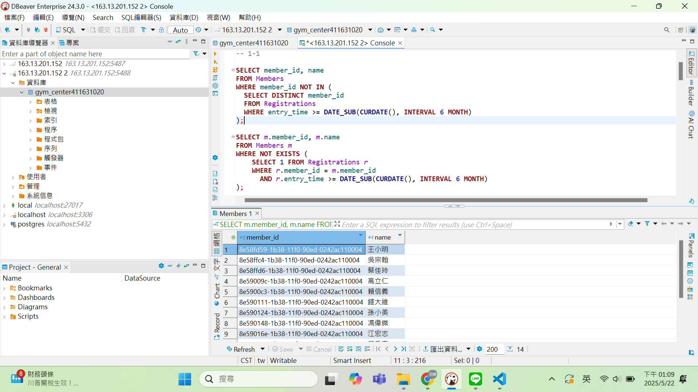
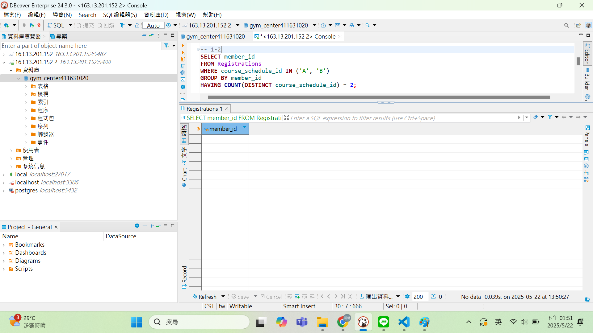
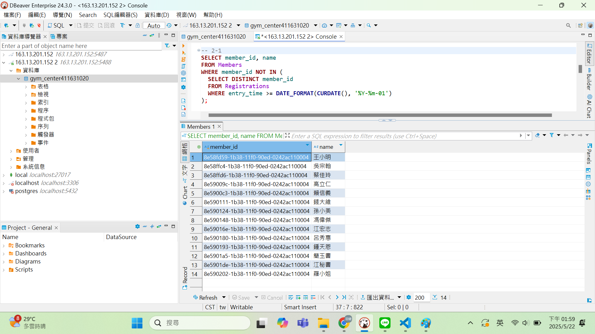
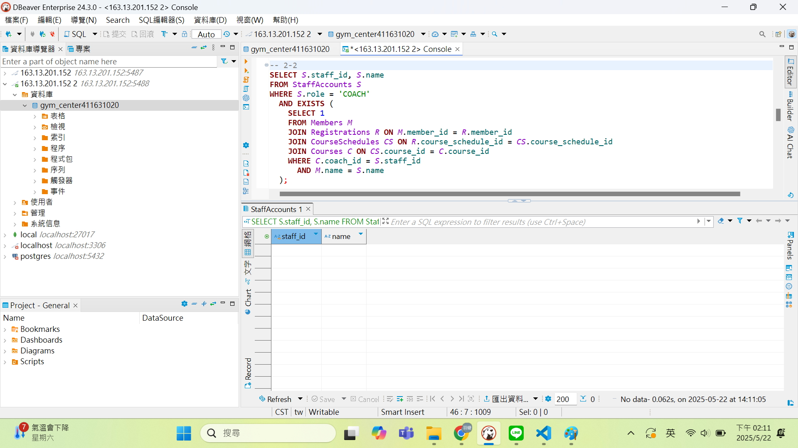
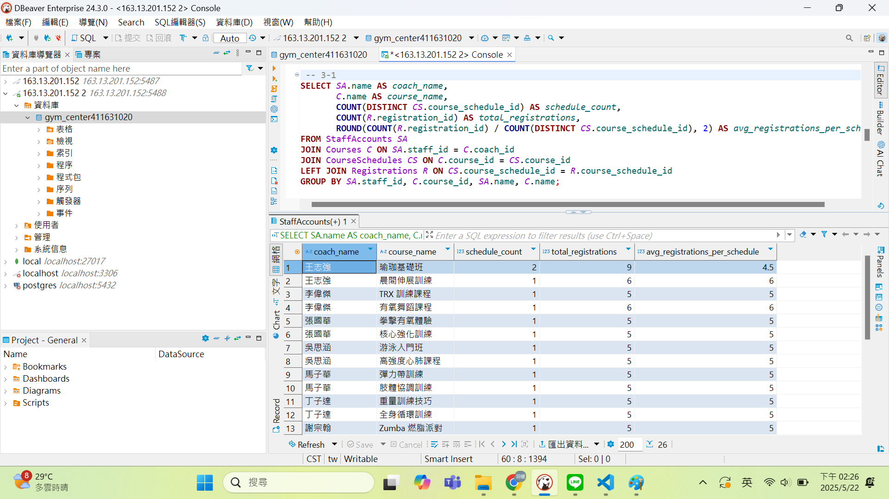
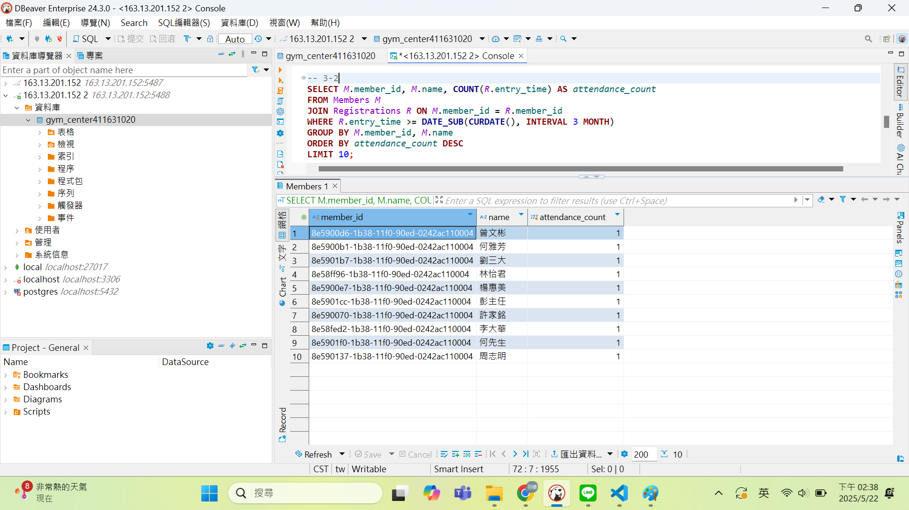
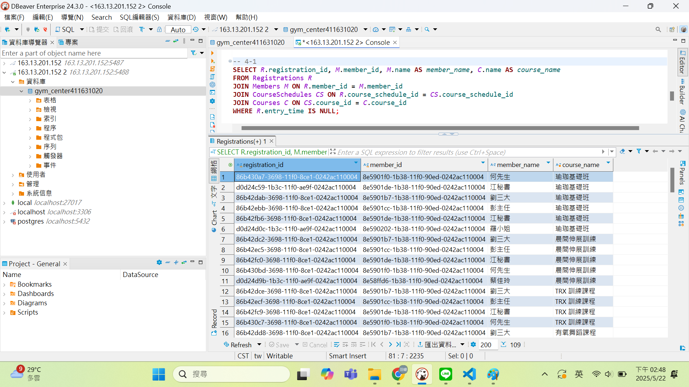
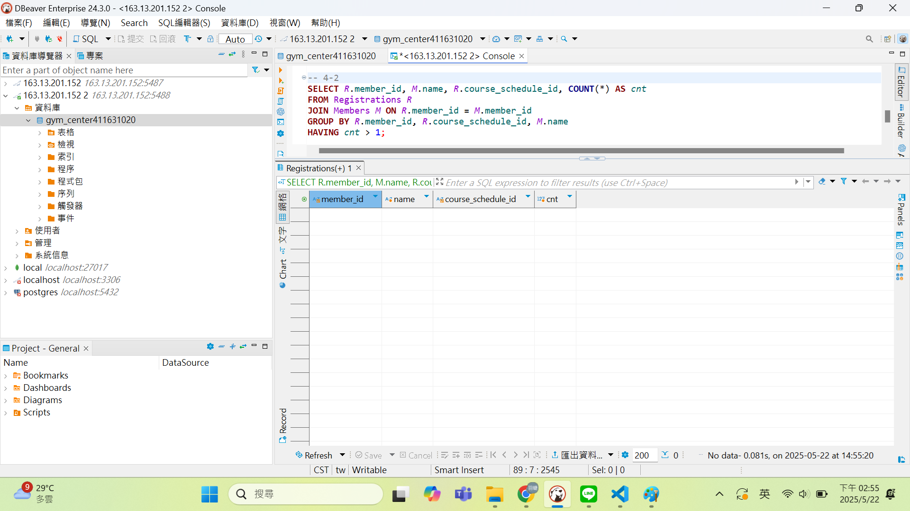
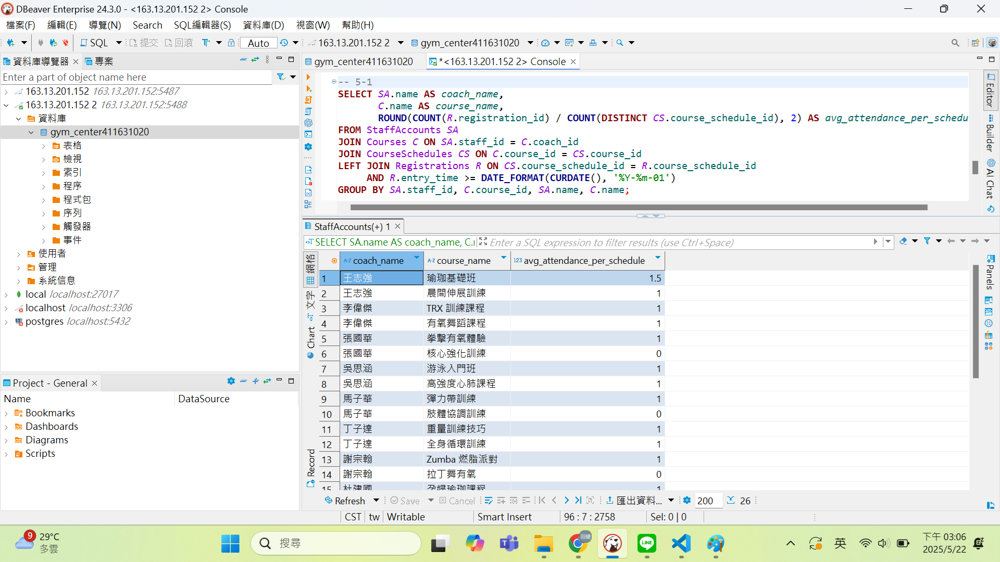
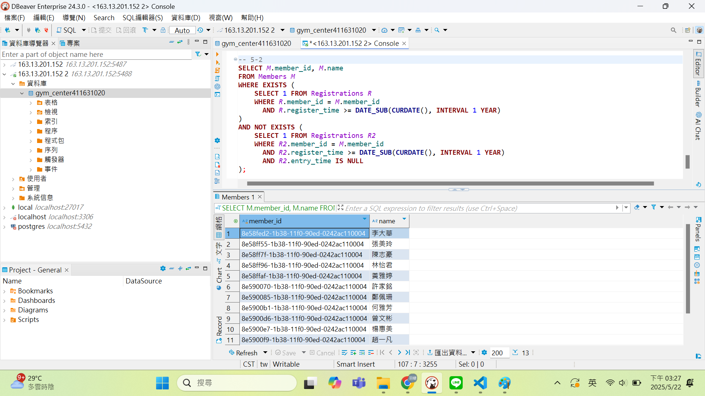

# Lab-06

## 1. 查詢與效能運算練習

### 題目 1-1

**列出「過去 6 個月未曾進場過的會員」的 `member_id` 與 `name`。**

* **可用解法**

    * **NOT IN**

    ```sql
    SELECT member_id, name
    FROM Members
    WHERE member_id NOT IN (
    SELECT DISTINCT member_id
    FROM Registrations
    WHERE entry_time >= DATE_SUB(CURDATE(), INTERVAL 6 MONTH)
    );
    ```

    * **NOT EXISTS**

    ```sql
    SELECT m.member_id, m.name
    FROM Members m
    WHERE NOT EXISTS (
        SELECT 1 FROM Registrations r
        WHERE r.member_id = m.member_id
        AND r.entry_time >= DATE_SUB(CURDATE(), INTERVAL 6 MONTH)
    );
    ```

    * **LEFT JOIN ... IS NULL**

    ```sql
    SELECT M.member_id, M.name
    FROM Members M
    LEFT JOIN (
    SELECT DISTINCT member_id
    FROM Registrations
    WHERE entry_time >= DATE_SUB(CURDATE(), INTERVAL 6 MONTH)
    ) R ON M.member_id = R.member_id
    WHERE R.member_id IS NULL;
    ```

* **效能分析**

    * `NOT IN`（尤其是子查詢有 `NULL` 值時）在資料量很大時不建議使用，易出現結果誤差。
    * `NOT EXISTS`、`LEFT JOIN ... IS NULL` 的寫法較為推薦，語義清楚，易於維護。



---

### 題目 1-2

**列出同時報名過兩個指定時段（假設 `course_schedule_id = 'A'`、`'B'`）的會員**

* **可用解法**

    * **GROUP BY ... HAVING COUNT**

    ```sql
    SELECT member_id
    FROM Registrations
    WHERE course_schedule_id IN ('A', 'B')
    GROUP BY member_id
    HAVING COUNT(DISTINCT course_schedule_id) = 2;
    ```

    * **自我聯結 (Self Join)**

    ```sql
    SELECT r1.member_id
    FROM Registrations r1
    JOIN Registrations r2
    ON r1.member_id = r2.member_id
    WHERE r1.course_schedule_id = 'A'
    AND r2.course_schedule_id = 'B'
    GROUP BY r1.member_id
    ```

    * **INTERSECT**

    ```sql
    SELECT member_id
    FROM Registrations
    WHERE course_schedule_id = 'A'
    AND member_id IN (
        SELECT member_id FROM Registrations WHERE course_schedule_id = 'B'
    );
    ```

* **效能分析**

    * `GROUP BY...HAVING`：聚合分組最佳，結合索引(`member_id`, `course_schedule_id`)時效能最高。
    * `self join`：適合查少數場次，`JOIN`次數隨條件增多而激增，對大表不友善。
    * `INTERSECT`：效率介於`GROUP BY`與`自我JOIN`之間，實務多用 `EXISTS/IN` 子查詢。



---

## 2. 子查詢與 EXISTS 效能比較

### 題目 2-1

**找出「本月內沒有任何進場記錄」的會員**

* **可用解法**

    * **NOT EXISTS**

    ```sql
    SELECT member_id, name
    FROM Members
    WHERE NOT EXISTS (
    SELECT 1 FROM Registrations
    WHERE Members.member_id = Registrations.member_id
        AND entry_time >= DATE_FORMAT(CURDATE(), '%Y-%m-01')
    );
    ```

    * **NOT IN**

    ```sql
    SELECT member_id, name
    FROM Members
    WHERE member_id NOT IN (
    SELECT DISTINCT member_id
    FROM Registrations
    WHERE entry_time >= DATE_FORMAT(CURDATE(), '%Y-%m-01')
    );
    ```

    * **LEFT JOIN ... IS NULL**

    ```sql
    SELECT M.member_id, M.name
    FROM Members M
    LEFT JOIN (
    SELECT DISTINCT member_id FROM Registrations WHERE entry_time >= DATE_FORMAT(CURDATE(), '%Y-%m-01')
    ) R ON M.member_id = R.member_id
    WHERE R.member_id IS NULL;
    ```

* **效能分析**

    * 推薦 `NOT EXISTS` 或 `LEFT JOIN ... IS NULL`（語意清楚，維護容易，較不受 `NULL` 影響）。
    * 若遇大資料量，建議避免 `NOT IN`，因遇 `NULL` 值結果可能不完整。



---

### 題目 2-2

**列出「至少曾參加自己擔任教練課程」的教練清單**

* **條件**

    * 教練同時在 `StaffAccounts`、`Courses` 表。
    * 曾以會員身份（`Members`）報名自己授課的課程（`Registrations`）。
    * 使用 `EXISTS` 撰寫。

* **可用解法**

    * **EXISTS**

    ```sql
    SELECT S.staff_id, S.name
    FROM StaffAccounts S
    WHERE S.role = 'COACH'
    AND EXISTS (
        SELECT 1
        FROM Members M
        JOIN Registrations R ON M.member_id = R.member_id
        JOIN CourseSchedules CS ON R.course_schedule_id = CS.course_schedule_id
        JOIN Courses C ON CS.course_id = C.course_id
        WHERE C.coach_id = S.staff_id
        AND M.name = S.name
    );
    ```



---

## 3. 聚合與索引優化練習

### 題目 3-1

**列出每位教練、其課程、課次總數及平均每場報名人數**

* **四表 JOIN：**`Courses`、`StaffAccounts`、`CourseSchedules`、`Registrations`
* **輸出欄位**

    * 教練姓名
    * 課程名稱
    * 課表數
    * 總報名人次
    * 平均報名人數

* **可用解法**

    * **多表 JOIN 與 GROUP BY 查詢**

    ```sql
    SELECT SA.name AS coach_name,
       C.name AS course_name,
       COUNT(DISTINCT CS.course_schedule_id) AS schedule_count,
       COUNT(R.registration_id) AS total_registrations,
       ROUND(COUNT(R.registration_id) / COUNT(DISTINCT CS.course_schedule_id), 2) AS avg_registrations_per_schedule
    FROM StaffAccounts SA
    JOIN Courses C ON SA.staff_id = C.coach_id
    JOIN CourseSchedules CS ON C.course_id = CS.course_id
    LEFT JOIN Registrations R ON CS.course_schedule_id = R.course_schedule_id
    GROUP BY SA.staff_id, C.course_id, SA.name, C.name;
    ```

* **JOIN 與 GROUP BY 排程說明**

    * 實務上，「由細至粗」`JOIN` 效能最好（先拿課程課次，再拉教練、再聚合）。
    * 本題已優化：先 `JOIN` 到 `CourseSchedules`，`LEFT JOIN` `Registrations`，再從教練/課程分組，SQL 優化器能最大化利用現有索引。
    * 聚合後再篩選或運算（如 `HAVING`）會更快於先大量 `JOIN` 再聚合。

* **索引最佳化建議**

    * 若資料量很大（數萬筆課程/報名），建議在「事務表」加複合索引，提升 `JOIN` 及 `GROUP BY` 聚合效能：

        * **Courses** (`coach_id`, `course_id`)
        * **CourseSchedules** (`course_id`, `course_schedule_id`)
        * **Registrations** (`course_schedule_id`, `registration_id`)

    * 若常做這類以 `course_id` 或 `coach_id` 聚合的報表，也可考慮在 `CourseSchedules`、`Registrations` 分別加上 (`course_id`) 與 (`course_schedule_id`) 單欄索引。
    * 聚合主要方向：應以報表「最細分」維度（本題為教練x課程）為 `GROUP BY`，再向下 `JOIN` 到明細（課次、報名）。



---

### 題目 3-2

**找出三個月內報到次數最多的 10 名會員**

* **輸出欄位**

    * member_id
    * name
    * 出席次數

* **可用解法**

    * 使用 `JOIN` 搭配 `GROUP BY`
    * 加入 `ORDER BY ... LIMIT 10`

    ```sql
    SELECT M.member_id, M.name, COUNT(R.entry_time) AS attendance_count
    FROM Members M
    JOIN Registrations R ON M.member_id = R.member_id
    WHERE R.entry_time >= DATE_SUB(CURDATE(), INTERVAL 3 MONTH)
    GROUP BY M.member_id, M.name
    ORDER BY attendance_count DESC
    LIMIT 10;
    ```

* **索引效能建議**

1. **Registrations (`member_id`, `entry_time`) 複合索引**

    * 此查詢的樞紐是在 `Registrations` 的 `member_id` 及 `entry_time`。
    * 有此索引：`JOIN AND WHERE` 會同時利用索引過濾（篩選出3個月內指定會員紀錄）。
    * `GROUP BY` 及 `COUNT` 計算數量時能有效利用 `index` 覆蓋（`covering index`）。

2. **Members 主鍵 (`member_id`) 已有索引**

    * 維持現有即可（ `JOIN` 會直接用上）。



---

## 4. 三值邏輯與重複/例外資料查核

### 題目 4-1

**查出 `entry_time` 為 `NULL` 的報名紀錄，並顯示會員與課程名稱**

* **可用解法**

    ```sql
    SELECT R.registration_id, M.member_id, M.name AS member_name, C.name AS course_name
    FROM Registrations R
    JOIN Members M ON R.member_id = M.member_id
    JOIN CourseSchedules CS ON R.course_schedule_id = CS.course_schedule_id
    JOIN Courses C ON CS.course_id = C.course_id
    WHERE R.entry_time IS NULL;
    ```

* **實務意義**

    * 多表 `JOIN` 可取回完整的會員與課程資訊，便於資料清理與後續通知、異常處理。
    * 這個查詢常用於稽核與資料品質檢查（誰還沒實際報到、資料漏登...）
    * 查詢結果可交由前台提醒、現場工作人員主動聯絡或系統自動提醒補登。



---

### 題目 4-2

**檢查同一會員在同一時段報名多次的情況**

* **輸出欄位**

    * member_id
    * name
    * course_schedule_id
    * 報名次數（`cnt` > 1）

* **可用解法**

    ```sql
    SELECT R.member_id, M.name, R.course_schedule_id, COUNT(*) AS cnt
    FROM Registrations R
    JOIN Members M ON R.member_id = M.member_id
    GROUP BY R.member_id, R.course_schedule_id, M.name
    HAVING cnt > 1;
    ```

* **查詢結果說明**
    * 無任何 `cnt` > 1 的結果，代表資料結構下目前沒有重複報名紀錄。
    * 這也通常是因為 `Registrations` 有 `UNIQUE` (`member_id`, `course_schedule_id`) 限制，有效避免了重複報名。



---

## 5. 多表關聯與綜合查詢效能

### 題目 5-1

**列出每位教練「本月」課程所有時段的平均出席人數**

* **四表 JOIN：**`StaffAccounts`、`Courses`、`CourseSchedules`、`Registrations`

* **可用解法**

    * **GROUP BY 教練、課程**

    ```sql
    SELECT SA.name AS coach_name,
       C.name AS course_name,
       ROUND(COUNT(R.registration_id) / COUNT(DISTINCT CS.course_schedule_id), 2) AS avg_attendance_per_schedule
    FROM StaffAccounts SA
    JOIN Courses C ON SA.staff_id = C.coach_id
    JOIN CourseSchedules CS ON C.course_id = CS.course_id
    LEFT JOIN Registrations R ON CS.course_schedule_id = R.course_schedule_id
        AND R.entry_time >= DATE_FORMAT(CURDATE(), '%Y-%m-01')
    GROUP BY SA.staff_id, C.course_id, SA.name, C.name;
    ```

* **效能最佳化建議**

若資料量大，建議做下列索引：
1. **Courses（`coach_id`, `course_id`）複合索引**
    * 讓教練搜尋課程時盡量利用索引，JOIN 時能減少全表掃描。
2. **CourseSchedules（`course_id`, `course_schedule_id`）複合索引**
    * 提升課程→課表之 `Join` 與聚合效率。
3. **Registrations（`course_schedule_id`, `entry_time`, `registration_id`）複合索引**
    * 支援以 `course_schedule_id` 與 `entry_time` 快速條件篩選及 `GROUP BY`。



---

### 題目 5-2

**列出一年內「從未缺席任何一場已報名時段」的全勤會員**

* **條件**

    * 每一筆 `Registrations` 都有 `entry_time`（不為 `NULL`）。

* **可用解法**

    * **NOT EXISTS**

    ```sql
    SELECT M.member_id, M.name
    FROM Members M
    WHERE EXISTS (
        SELECT 1 FROM Registrations R
        WHERE R.member_id = M.member_id
        AND R.register_time >= DATE_SUB(CURDATE(), INTERVAL 1 YEAR)
    )
    AND NOT EXISTS (
        SELECT 1 FROM Registrations R2
        WHERE R2.member_id = M.member_id
        AND R2.register_time >= DATE_SUB(CURDATE(), INTERVAL 1 YEAR)
        AND R2.entry_time IS NULL
    );
    ```

    * **NOT IN**

    ```sql
    SELECT M.member_id, M.name
    FROM Members M
    WHERE M.member_id IN (
        SELECT R.member_id FROM Registrations R
        WHERE R.register_time >= DATE_SUB(CURDATE(), INTERVAL 1 YEAR)
    )
    AND M.member_id NOT IN (
        SELECT R2.member_id FROM Registrations R2
        WHERE R2.register_time >= DATE_SUB(CURDATE(), INTERVAL 1 YEAR)
        AND R2.entry_time IS NULL
    );
    ```


* **效能比較**

    * `NOT EXISTS` 通常效率穩定且最佳化效果好，因為只要找到一筆 `entry_time IS NULL` 的資料就直接判定「非全勤」(`anti semi-join`)，不會做大量集合運算。
    * `NOT IN` 就算已建索引，集合運算過程也會大於 `EXISTS`，尤其當子查詢有 `NULL` 時，不推薦使用。
    * 真實大資料環境下，`NOT EXISTS` 幾乎是排除型子查詢的首選。

* **更好的做法**

以聚合 `GROUP BY HAVING` 求「**無缺席**」：

```sql
SELECT M.member_id, M.name
FROM Members M
JOIN Registrations R ON M.member_id = R.member_id
WHERE R.register_time >= DATE_SUB(CURDATE(), INTERVAL 1 YEAR)
GROUP BY M.member_id, M.name
HAVING SUM(R.entry_time IS NULL) = 0;
```

* 只要該會員所有紀錄都沒有 `NULL`（`SUM` = 0），就為全勤。
* 此寫法聚合時能以 `index scan` 高效執行，效能優於大量子查詢。



---

